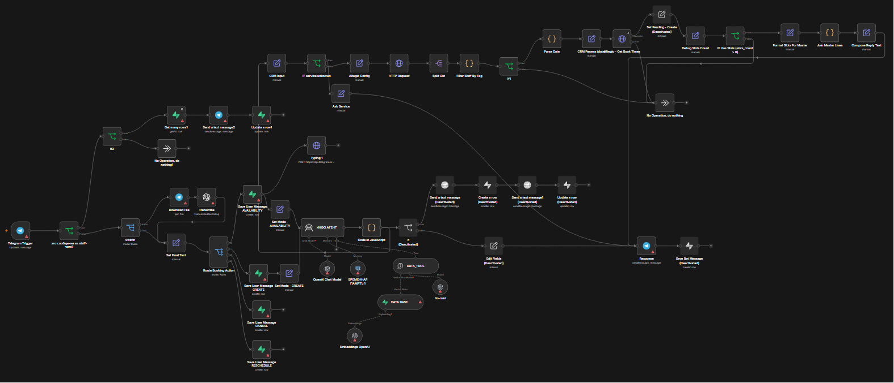

# AI Virtual Administrator for Beauty Salon

## Overview

AI-powered virtual administrator designed to automate customer communication for a beauty salon through Telegram.

The system understands text and voice messages, answers customer questions according to predefined business rules, helps collect appointment-related information, and can transfer important requests to a human manager when needed.

## Workflow

## Business Problem

Beauty salons often spend a lot of time answering repetitive customer questions, handling appointment requests manually, and coordinating communication between clients and administrators.

## Solution

This project is a no-code AI automation workflow that acts as the first point of contact for customers.

The system can:

- understand text and voice messages;
- communicate in multiple languages;
- answer questions strictly according to predefined instructions;
- collect important client information;
- forward important requests to a management chat;
- send the manager's response back to the client;
- reduce manual communication while keeping responses clear and consistent.

## My Role

Designed and implemented the complete automation workflow independently.

Responsibilities included:

- workflow architecture;
- AI prompt design;
- Telegram bot integration;
- OpenAI integration;
- message routing logic;
- automation scenario design;
- testing and optimization.

## Technologies

- n8n
- OpenAI API
- Telegram Bot API
- Prompt Engineering
- AI Workflow Automation

## Planned Improvements

- CRM integration
- automatic appointment scheduling;
- customer database synchronization;
- analytics dashboard.

## Note

This is a personal practice project. Client-specific data is not used or published.
